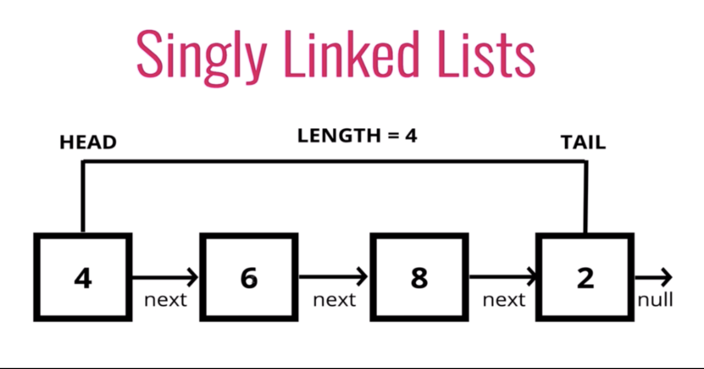
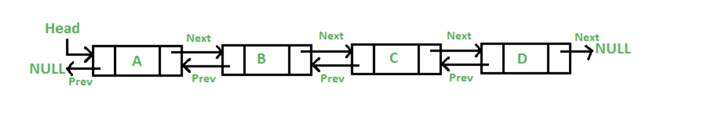

# Linked List

Linked lists have some of the most useful applications because of their ease to implement and their efficieny

## Efficiency
* Linked lists have an efficency of O(1) for both adding and removing elements from the list. 

## Basic Structure
The basic structure of a linked list is a collection of elements where each element has a pointer or referance to the next element in the collection. Linked Lists do not have to be stored in memory side by side because of this pointer. The basic sturcture of a linked list is where each element points to the next (one way) but some linked lists can also be double ended where each element in the collection points to the next and the previous one.

## Types of Linked Lists
### Single Ended
In a singally linked linked list a target element can be removed by finding the previous element and pointing the previous element's next pointer to the element after our target element.
A good example of this kind of linked list is a scavenger hunt where one clue points to the next.
See an example of an implementation of a <a href="single.py">Singally Linked Linked List</a>

Here is a picture of a singally linked linked list courtsey of <a href="https://javascript.plainenglish.io/understanding-singly-linked-lists-and-their-functions-ae8f2e53f92d">JavaScript in Plain English</a>

### Double Ended
In a double ended linked list a target element can be removed by finding the previous element and pointing the previous element's next pointer to the element after our target element. We must also then take the previous pointer on the element after our target element and point it to the element previous to our target element.
A good example of this kind of queue is a game of red rover where participants must link arms with both the person on their left and on their right. 
See an example of an implementation of a <a href="double.py">Double Ended Linked List</a>
Here is a picture of a double ended linked list courtesy of <a href="https://techlogybuzz.wordpress.com/2018/02/25/array-lists-how-are-they-implemented/">Technology Buzz</a>

## Example
In this <a href="example.py">example</a> I will walk you through how to implement a singally linked list for a conga line.

## Practice
In this <a href="practice.py">practice problem</a> you will implement a basic queue with a linked list.
See the solution <a href="solution.py">here</a>.