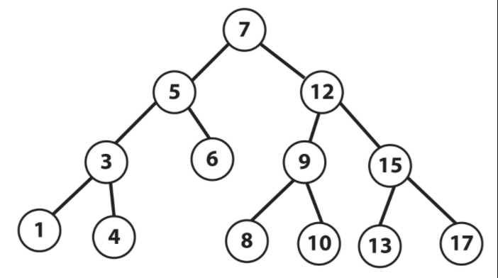
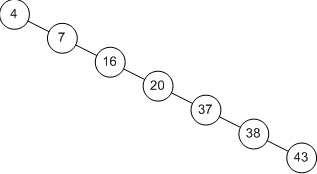

# Trees
A binary search tree is a very also very efficient in its operations because like a linked list it connects nodes to each other by pointers.
## Efficiency
* Inserting into, removing from, and finding a value in a binary search tree are all O(log n) because with each iteration you rule out half of the nodes in the tree.
* To traverse a tree or get the height it is O(n) because every node in the tree must be visited exactly once.
* To get the size of the tree is O(1) as this value is stored in the tree.

## Basic Structure: Binary Search Tree
* In a binary search tree there is a root node that can be though of as the trunk of a tree. That node can link no more than two other nodes. These nodes can be thought of as branches. Each node in the tree can have no more than two other nodes connected to it. Furthermore if a parent node wants to connect two more nodes to the tree then the node with the value less than the parent node goes to one side of the tree and the node with the value greater than the parent node goes to the other. This must be consistent throughout the entire tree. A node that does not connect any other nodes can be thought of as a leaf node. 
* See this picture courtsey of <a href="https://subscription.packtpub.com/book/application_development/9781789801736/8/ch08lvl1sec47/implementing-binary-search-tree">Java Fundamentals</a>

# Recursion
* An important component to the binary search tree is recursion. Recursion is the process of a function calling itself in the process of computing a result. The key to understanding recursion is first breaking down the larger problem into a series of smaller problems and then determining the stopping condition that will return the final calculation. 

## Types
In addition to the binary search tree there are some variations with trees which should be noted:
# Unbalanced Vs Balanced
The advantage of a binary search tree, that is efficieny in insertions and removals, is completely lost when a tree is unbalanced. This is because an unbalanced tree has basically become a list where we have to visit each element in the tree in the worst case scenario making it O(n). A tree is considered balanced if the height of any two subtrees is not dramatically different. To calculate the height of a tree is found by counting the maximum number of nodes between the root and the leaves.
* See an example of an unbalanced tree below courtesy of <a href="https://www.epaperpress.com/sortsearch/bin.html">epaperpress.com</a> 

## Example
In this example I will walk you through implementing a <a href="basic.py">basic tree structure</a>

## Practice
In this exercise, you will again implement a customer service priority queue with a binary search tree.
* <a href="practice.py">Start Here</a>
* <a href="solution.py">See the solution here</a>